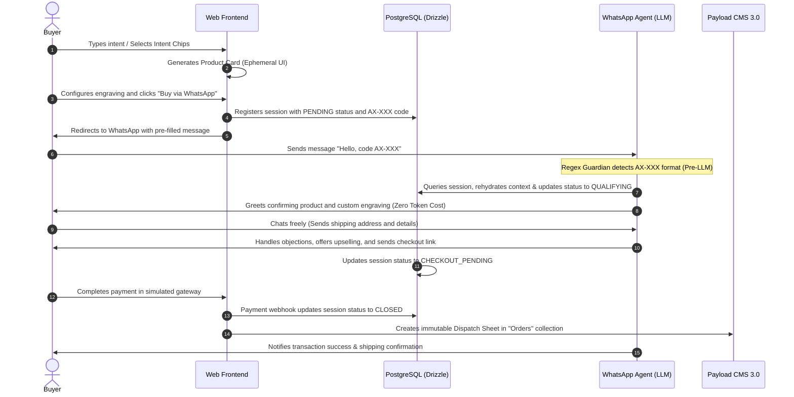

# Agento — Proof of Concept (PoC)
> **Two-Phase Agentic Commerce: Web Discovery and Autonomous Closing on WhatsApp**

[](#)
[](#)
[](#)

This repository contains the **Proof of Concept (PoC)** for **Agento**, a platform designed to automate and optimize conversational sales for high-value niche crafts and custom manufacturing operations (specifically modeled for Shirley's high Average Order Value crafts business in Cartagena).

The goal of this PoC is to validate the business and technical hypothesis that high-value buyers are willing to **transfer their purchase intent from the web to WhatsApp and autonomously complete transactions with a conversational bot**.

---

## 1. The Business Challenge

Traditional niche e-commerce for high-value crafts suffers from two critical points of friction:

1.  **The Failure of Passive E-commerce**: Customers purchasing highly aesthetic, cultural, or custom pieces rarely buy through a traditional "cold self-service" web cart. They demand a consultative sales process to validate dimensions, wood options, finishes, or custom engravings.
2.  **The Collapse of the Conversational Channel**: To satisfy this need, businesses redirect web traffic directly to WhatsApp. This creates a severe operational bottleneck: human sales operators waste up to **60% of their time** answering repetitive catalog and price questions from low-intent leads, losing focus on high-intent buyers.

---

## 2. The Solution: Two-Phase Agentic Commerce

Agento resolves this bottleneck by splitting the sales funnel into two automated phases:

```
┌─────────────────────────────────┐        Handoff       ┌─────────────────────────────────┐
│         PHASE 1: WEB            │  ─────────────────►  │       PHASE 2: WHATSAPP         │
│   (Semantic Discovery)          │     AX-XXX Code      │    (Qualifying & Closing)       │
│ Qualifies, recommends & hooks   │                      │ Negotiates, upsells & bills     │
└─────────────────────────────────┘                      └─────────────────────────────────┘
```

*   **Phase 1 (Web Semantic Discovery)**: The customer states what they are looking for in natural language (e.g., *"I'm looking for an anniversary gift made of teak wood"*). The system recommends items using interactive, ephemeral Product Cards. The buyer configures custom options (like wood finishes or text engravings) and is assigned a **unique handoff code** (`AX-XXX`) before being redirected to WhatsApp with one click.
*   **Phase 2 (WhatsApp Conversational Closing)**: The customer sends the auto-generated code via WhatsApp. The bot instantly rehydrates the cart context without consuming AI tokens. An autonomous LLM agent then qualifies the lead, handles logistical details, details custom upselling options, and delivers a secure checkout link (Stripe/Wompi) to close the deal.

---

## 3. User Journey and Data Flow

The following diagram illustrates how the handoff session state (`handoff_sessions`) transitions through the PoC architecture:



---

## 4. PoC Technical Stack

To ensure rapid deployment and ease of testing, the PoC is built as a **strongly-typed single monolith**:

*   **Next.js 15 (App Router)**: Powers the frontend, the ephemeral product configurators, and serverless API endpoints.
*   **Payload CMS 3.0 (Embedded)**: Acts as both the catalog management system and the "Intrinsic CRM" where the business owner checks paid dispatch orders.
*   **Drizzle ORM & PostgreSQL**: Provides fast persistence for the state machine tracking active handoff sessions.
*   **Vercel AI SDK**: Leverages OpenAI to deliver natural language discovery on the web and conversational sales negotiation on WhatsApp.
*   **Built-in WhatsApp Web Simulator**: A custom split-screen panel embedded in the web frontend simulating webhook requests to allow full end-to-end testing without needing live Meta Cloud API credentials.

---

## 5. Metrics to Validate the Business Hypothesis

The success of this PoC will be validated using three core business KPIs:

1.  **Handoff Rate (Channel Conversion)**: The percentage of web visitors who configure a product and click "Buy via WhatsApp," successfully generating a session code.
2.  **Autonomous Closing Rate**: The percentage of WhatsApp conversations initiated with a handoff code that successfully complete checkout without human agent intervention.
3.  **Transaction Profitability (Unit Economics)**: Verification that the consolidated cost of LLM tokens consumed per closed session does not exceed 2.5% of the average order value.
