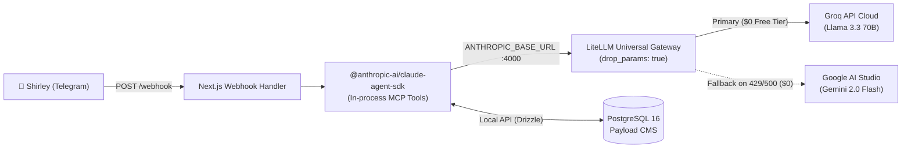

# ADR-002: Zero-Cost Agent Runtime via Claude Agent SDK, LiteLLM Gateway & Groq Cloud

* **Status:** Accepted
* **Date:** 2026-08-21
* **Deciders:** Architecture & AI Engineering Team
* **Consulted:** Business & Infrastructure Operations

---

## 1. Context and Problem Statement

Shirley needs an automated management assistant on Telegram to query inventory, list open orders, adjust stock, highlight products on the landing page, and confirm orders directly from her phone while at artisan fairs or in the workshop.

The prototype (v3.2) used a custom, hand-rolled TypeScript router (`src/lib/agents/orchestrator.ts`) with hardcoded keyword regexes and raw `groq-sdk` calls. This approach has poor intent recognition, lacks formal multi-turn agent looping, and is difficult to extend with typed tool schemas.

However, running enterprise agent frameworks directly on paid models (such as Claude 3.5 Sonnet or GPT-4o) would introduce a recurring monthly token cost that contradicts the low-overhead business model of an artisanal shop.

---

## 2. Decision Drivers

* **$0 Monthly LLM Bill:** Must leverage free-tier high-performance inference.
* **Senior Agent Framework:** Utilize `@anthropic-ai/claude-agent-sdk` for typed tool definitions, structured message loops, and native in-process MCP (Model Context Protocol) tool execution.
* **Universal Model Gateway:** Decouple application code from underlying LLM providers to allow instantaneous model swapping and automatic failover.
* **Resilience:** Fallback mechanism if the primary free provider experiences transient rate limits (HTTP 429) or outages.

---

## 3. Considered Options

* **Option 1: Continue Hand-Rolled Regex Orchestrator (`groq-sdk`):** High maintenance burden, fragile multi-turn handling, brittle regex routing.
* **Option 2: LangChain / LlamaIndex:** Heavy runtime dependencies, bloated bundle size (>150MB), steep learning curve, frequent breaking changes.
* **Option 3: Direct Claude 3.5 Sonnet API via Agent SDK:** Excellent reasoning, but generates a monthly token bill per message.
* **Option 4 (Chosen): Claude Agent SDK + LiteLLM Universal Gateway (:4000) + Groq (Llama 3.3 70B Free) with Google Gemini Flash Fallback:**
  1. The bot runtime uses `@anthropic-ai/claude-agent-sdk` pointed to `ANTHROPIC_BASE_URL=http://localhost:4000`.
  2. A lightweight self-hosted **LiteLLM Proxy container** runs locally on port `:4000` (~50MB RAM).
  3. LiteLLM translates Anthropic Messages API calls into OpenAI chat completions and routes them to **Groq Cloud (Llama 3.3 70B Versatile)** at **$0 cost** with `drop_params: true`.
  4. If Groq hits rate limits or downtime, LiteLLM automatically routes to **Google Gemini 2.0 Flash (Google AI Studio Free Tier)** as a secondary $0 fallback.

---

## 4. Decision Outcome

**Chosen Option:** **Option 4 (Claude Agent SDK + LiteLLM Gateway on Groq + Gemini Fallback)**.



### Positive Consequences:
* **Zero Token Cost ($0):** Operates completely within free tiers.
* **Developer Ergonomics:** Full TypeScript type safety for tools using Zod schemas via `@anthropic-ai/claude-agent-sdk`.
* **Zero Code Vendor Lock-in:** Swapping providers or upgrading to paid Claude in the future requires editing only `litellm/config.yaml`.
* **Automatic Failover:** Resilient against single-provider hiccups.

### Negative Consequences / Trade-offs:
* Running an additional Docker container for LiteLLM (~50MB RAM on host).
* LiteLLM must strip unsupported Anthropic parameters (`drop_params: true`) when talking to Groq/OpenAI endpoints.

---

## 5. Implementation Configuration

### `litellm/config.yaml`:
```yaml
model_list:
  - model_name: nenufar-bot
    litellm_params:
      model: groq/llama-3.3-70b-versatile
      api_key: os.environ/GROQ_API_KEY
      drop_params: true

  - model_name: nenufar-bot-fallback
    litellm_params:
      model: gemini/gemini-2.0-flash
      api_key: os.environ/GEMINI_API_KEY
      drop_params: true

router_settings:
  fallbacks:
    - "nenufar-bot": ["nenufar-bot-fallback"]
  retry_on_status_codes: [429, 500, 503]
```
