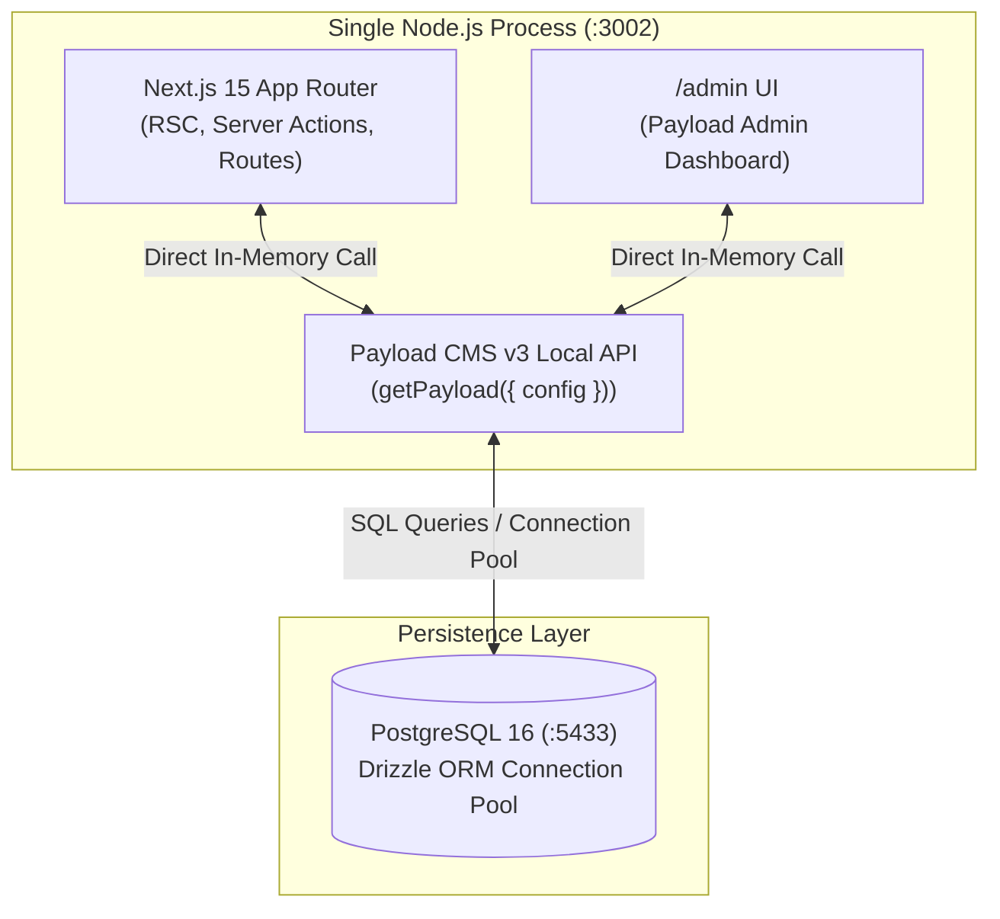

# ADR-003: Single-Process Node.js Monolith with Next.js 15 & Embedded Payload CMS v3 Local API

* **Status:** Accepted
* **Date:** 2026-08-21
* **Deciders:** Engineering & DevOps Team
* **Consulted:** System Performance & Infrastructure

---

## 1. Context and Problem Statement

Headless CMS architectures frequently decouple the frontend (e.g., Next.js on Vercel) from the CMS backend (e.g., Strapi, Sanity, WordPress on separate servers). This separation introduces multiple operational complexities:
* Network latency on every REST/GraphQL request between frontend and backend.
* Managing CORS, complex authentication tokens, and webhook synchronization.
* Increased hosting costs and deployment synchronization friction.

Payload CMS v3 runs natively as Next.js App Router route handlers (`/api/graphql`, `/api/[...slug]`) within the exact same Node.js runtime process. How should Nénufar query and mutate data across Storefront, Admin panel, and Telegram bot?

---

## 2. Decision Drivers

* **Minimal Hosting Overhead:** Deployable on a single low-cost VPS ($5-10/mo) via Docker Compose.
* **Zero Network Latency for Data Access:** Direct in-process database access without HTTP roundtrips.
* **Full TypeScript Type Sharing:** Single shared `payload-types.ts` generated from schema collections across the entire frontend and backend.
* **Unified Security & Authentication:** Co-located sessions and server action execution.

---

## 3. Considered Options

* **Option 1: Decoupled Architecture (Separate CMS API & Separate Next.js App):** Double deployment pipelines, cross-service network latency, complex API token management.
* **Option 2: Payload CMS via HTTP REST / GraphQL Endpoints internally:** Serializing JSON over HTTP within the same server introduces unnecessary CPU and serialization overhead.
* **Option 3 (Chosen): Embedded Payload CMS v3 with Local API (`getPayload`):**
  * Payload runs inside the Next.js process (`src/payload.config.ts`).
  * Server components, Server Actions (`submitOrderAction.ts`), and Telegram Webhook handlers use the **Payload Local API** (`payload.find`, `payload.create`, `payload.update`, `payload.delete`).
  * Queries execute directly against PostgreSQL via Drizzle ORM in-memory with zero network overhead.

---

## 4. Decision Outcome

**Chosen Option:** **Option 3 (Embedded Payload CMS v3 with Local API)**.

### Positive Consequences:
* **Blazing Fast Performance:** In-memory Local API bypasses HTTP stack, serialization, and network roundtrips.
* **Atomic Transactions & Hooks:** Payload collection hooks (`beforeChange`, `afterChange`, `revalidatePage`) run synchronously.
* **Single Deployment Artifact:** One `Dockerfile` / `docker-compose.yml` builds and deploys both the storefront and admin panel.
* **Unified Developer Experience:** Changes to schemas regenerate types immediately (`pnpm generate:types`).

### Negative Consequences / Trade-offs:
* CPU-intensive tasks (e.g. Sharp image resizing) run on the same instance as web requests (mitigated by asynchronous background execution and small catalog size).
