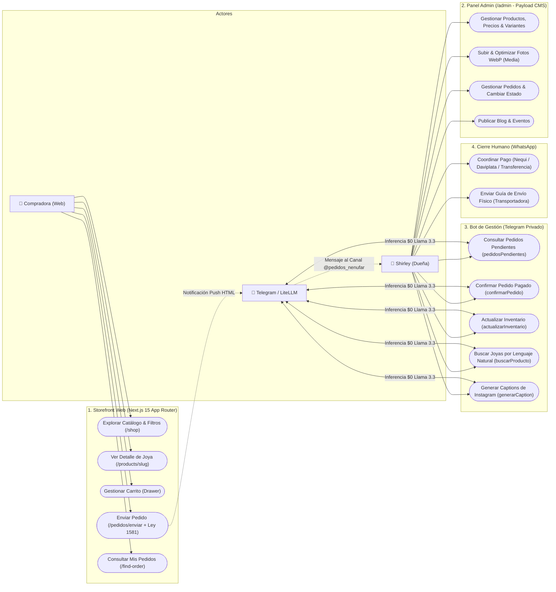

# Diagramas de Casos de Uso — Nénufar

Este documento modela formalmente los actores del sistema y los casos de uso disponibles para cada uno.

---

## 1. Principio Arquitectónico de Fronteras

* **Compradora (Web):** Su recorrido es **100% web**. No interactúa con el bot de Telegram ni con la IA.
* **Shirley (Dueña/Artesana):** Opera el negocio a través de 3 superficies:
  1. Panel `/admin` (Payload CMS).
  2. Bot de Gestión privado de Telegram (`TELEGRAM_ADMIN_CHAT_ID`).
  3. WhatsApp (cierre manual de ventas, recepción de comprobantes y envío de guías).
* **Telegram & LiteLLM:** Infraestructura de mensajería y proxy de inferencia gratuita sobre Groq.

---

## 2. Diagrama de Casos de Uso (UML / Mermaid)

---

## 3. Matriz de Casos de Uso por Actor

| Actor | Caso de Uso | Superficie | Destino en Base de Datos |
| :--- | :--- | :--- | :--- |
| **Compradora** | `Explorar Catálogo` | `/shop` | Lectura `products` (`_status = published`) |
| **Compradora** | `Enviar Pedido` | `/pedidos/enviar` | Escritura `orders` (`status = pending`) + Notificación Telegram |
| **Shirley** | `Gestionar Catálogo` | `/admin` | CRUD `products`, `categories` |
| **Shirley** | `Subir Fotos` | `/admin` | CRUD `media` (Auto WebP 4 tamaños vía Sharp) |
| **Shirley** | `Consultar Pedidos` | Bot Telegram | Lectura `orders` vía Claude Agent SDK tool |
| **Shirley** | `Confirmar Pedido` | Bot Telegram | Actualización `orders.status = confirmed` |
| **Shirley** | `Actualizar Stock` | Bot Telegram | Actualización `products.stock` o variante |
| **Shirley** | `Coordinar Pago` | WhatsApp | Sin DB (trato humano directo con la clienta) |
