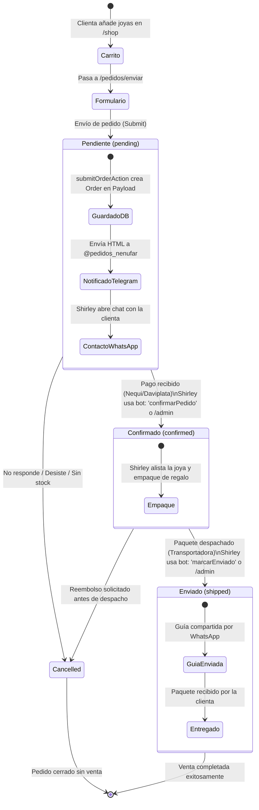
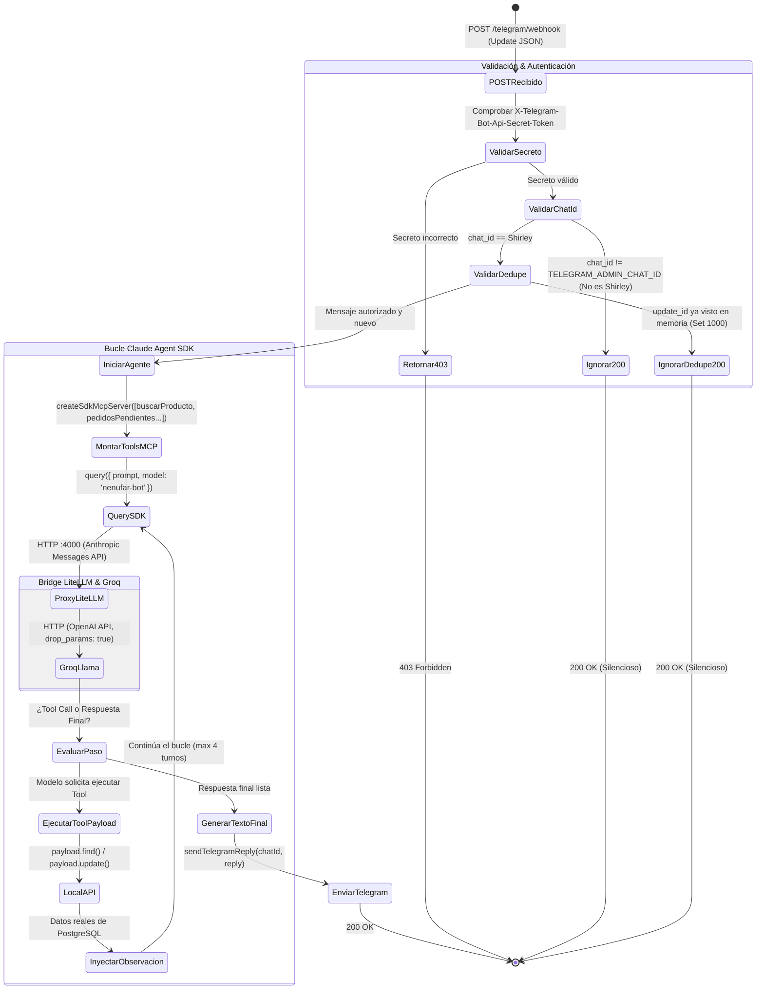

# Diagramas de Estado (State Machines) — Nénufar

Este documento detalla las máquinas de estado finitas para los dos ciclos de vida fundamentales de Nénufar:
1. **Ciclo de Vida del Pedido (`Order`)** — Estado del negocio y del dinero.
2. **Ciclo de Vida del Bot de Gestión (`Claude Agent SDK Runtime`)** — Estado del bucle de inferencia y herramientas.

---

## 1. Máquina de Estados del Pedido (`Order`)

Muestra cómo evoluciona una orden desde que la clienta agrega piezas al carrito hasta su entrega final.

### Reglas de Transición del Pedido:
* `pending` → `confirmed`: Solo Shirley puede confirmar una vez verificado el comprobante de pago en su banco o Nequi.
* `confirmed` → `shipped`: Ocurre cuando Shirley entrega el paquete a la transportadora (Interrapidísimo, Envía, etc.) y genera la guía de rastreo.
* `cancelled`: Puede ocurrir en cualquier punto antes del despacho físico.

---

## 2. Máquina de Estados del Bot de Gestión (Claude Agent SDK)

Muestra el procesamiento de cada mensaje entrante en `POST /telegram/webhook`.

