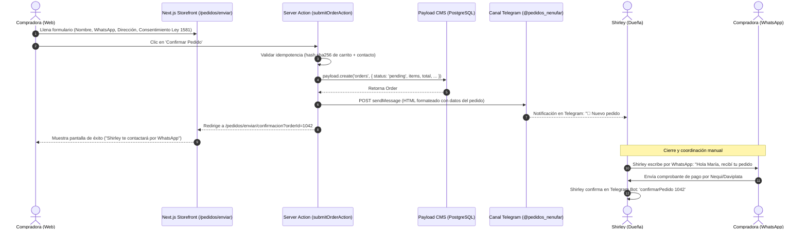
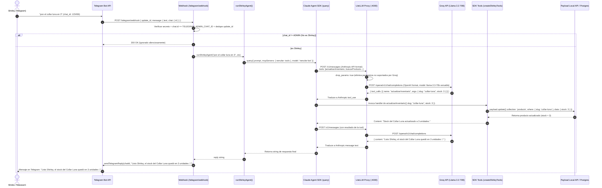

# Diagramas de Interacción e Integración (Secuencia) — Nénufar

Este documento contiene los diagramas de secuencia e interacción de componentes para:
1. **Flujo de Compra y Notificación** (Storefront Web → Telegram Channel → WhatsApp).
2. **Flujo de Gestión con IA** (Shirley ↔ Telegram ↔ Claude Agent SDK ↔ LiteLLM Proxy ↔ Groq ↔ Payload CMS).

---

## 1. Flujo de Compra y Notificación de Pedido

Muestra cómo la compradora envía su carrito en la web, cómo se persiste en PostgreSQL sin pasarela de pago y cómo Shirley recibe la notificación en su canal de Telegram.



---

## 2. Flujo de Consulta y Gestión del Bot de Shirley (Claude Agent SDK + LiteLLM + Groq)

Muestra cómo un mensaje de Shirley en Telegram viaja a través del SDK, se traduce por LiteLLM hacia Groq de forma gratuita y ejecuta herramientas directas sobre Payload CMS.



---

## 3. Diagrama de Topología de Infraestructura Local (Docker)

```mermaid
flowchart TB
    subgraph Host["Máquina Local / VPS"]
        App["Next.js 15 + Payload CMS Monolito (:3002)"]
        LiteLLM["LiteLLM Proxy Container (:4000)"]
        Postgres["PostgreSQL 16 Container (:5433)"]
        
        App <-->|Local API / Drizzle| Postgres
        App <-->|Anthropic Messages API| LiteLLM
    end

    subgraph Externo["Servicios Externos"]
        Telegram["Telegram Bot API"]
        Groq["Groq API (Llama 3.3 70B - Free)"]
    end

    Telegram <-->|Webhook Inbound / Notif Outbound| App
    LiteLLM <-->|OpenAI API (GROQ_API_KEY)| Groq
```
