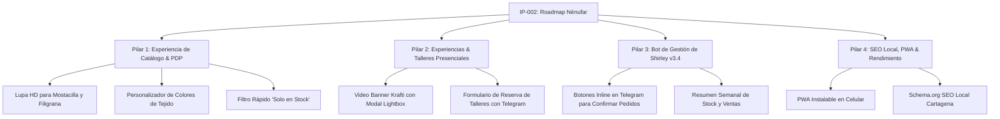

# IP-002: Implementation Proposal — Roadmap Estratégico de Mejoras Futuras para Nénufar

* **Identificador:** `IP-002`
* **Título:** Roadmap de Evolución y Mejoras Continuas para Nénufar Joyería Artesanal
* **Autor:** Equipo de Ingeniería y Diseño UI/UX
* **Fecha:** 2026-08-26
* **Estado:** Propuesta Aprobada / En Cola de Implementación
* **Specs Relacionadas:** [`SPEC-001`](../specs/SPEC-001-storefront-checkout.md), [`SPEC-002`](../specs/SPEC-002-management-bot-runtime.md), [`SPEC-003`](../specs/SPEC-003-catalog-landing-blocks.md), [`SPEC-004`](../specs/SPEC-004-brand-design-system.md)

---

## 1. Contexto y Objetivos

Tras la consolidación exitosa de la identidad visual Krafti, el rediseño del catálogo y la eliminación de pasarelas de pago costosas, este documento traza las iniciativas de mayor retorno de inversión para Nénufar en los próximos ciclos de desarrollo, respetando estrictamente los 7 Artículos de la Constitución ($0/mes, performance ultra-rápido y simplicidad operativa para Shirley).

---

## 2. Mapa Estratégico de Mejoras (4 Pilares)



---

## 3. Detalle de Iniciativas por Pilar

### 💎 Pilar 1: Experiencia de Catálogo & Detalle de Joya (PDP)

#### 1.1. Lupa / Visualizador Interactivo de Alta Resolución
* **Problema:** Las clientas necesitan apreciar la micro-calibración de la mostacilla japonesa y la textura del hilo de filigrana antes de decidir su compra.
* **Solución Técnica:** Componente `ImageZoomViewer` con ampliación táctil (pinch-to-zoom en móvil y lupa flotante con cursor en desktop), usando las imágenes WebP generadas en `Media` sin librerías externas pesadas.

#### 1.2. Muestrario y Personalizador Visual de Colores
* **Problema:** Muchas clientas piden la misma joya en combinaciones personalizadas (ej. tonos tierra, atardecer caribeño, azul océano).
* **Solución:** Selector de paletas de color con vista previa instantánea en la página de producto y botón directo *"Pedir esta combinación a Shirley"*.

#### 1.3. Filtro Rápido "Solo en Stock"
* **Solución:** Toggle en `ShopFilterBar` que oculta automáticamente los artículos agotados para usuarias con intención de compra inmediata.

---

### 🌴 Pilar 2: Experiencias & Talleres Presenciales en Cartagena

#### 2.1. Bloque de Video Banner Krafti
* **Solución Técnica:** Componente `VideoBanner` con portada cinematográfica y botón circular *Play*. El reproductor se carga exclusivamente bajo demanda (*lazy load*), manteniendo 0 KB de carga inicial y puntuación de 100 en Core Web Vitals.

#### 2.2. Módulo de Reserva Directa de Cupos para Talleres
* **Solución:** Modal de inscripción rápida en 2 pasos para los talleres de tejido en Getsemaní. El pedido de cupo se inserta en Payload como una orden de servicio y dispara una notificación inmediata a Shirley por Telegram con los datos de la alumna.

---

### 🤖 Pilar 3: Bot de Gestión de Shirley (Telegram Bot v3.4)

#### 3.1. Botones Interactivos (*Inline Keyboards*) en Notificaciones de Pedido
* **Solución:** Cuando llega un nuevo pedido a Telegram, el bot incluye botones táctiles:
  ```
  [ ✅ Confirmar Pago ]   [ 📦 Guía de Envío ]   [ ❌ Cancelar ]
  ```
  Al pulsar un botón, el bot actualiza el estado de la orden en PostgreSQL de forma instantánea sin necesidad de que Shirley escriba comandos de texto.

#### 3.2. Resumen Semanal de Operación
* **Solución:** Cron automático (lunes 8:00 AM) que envía a Shirley un resumen con:
  - Total de pedidos atendidos en la semana.
  - Joyas más vendidas.
  - Alerta de piezas con inventario menor a 2 unidades.

---

### ⚡ Pilar 4: SEO Local, PWA & Rendimiento

#### 4.1. Progressive Web App (PWA)
* **Solución:** `manifest.json` y Service Worker ligero para permitir que Shirley y sus clientas frecuentes instalen "Nénufar" directamente en su pantalla de inicio de Android/iOS como una aplicación nativa.

#### 4.2. SEO Local Estructurado (Schema.org)
* **Solución:** Incorporación de metadatos `LocalBusiness`, `JewelryStore` y `Event` en Next.js para posicionar en Google en búsquedas de turistas: *"joyería artesanal Cartagena"*, *"talleres de tejido Cartagena"*, *"comprar filigrana Cartagena"*.

---

## 4. Matriz de Priorización (Impacto vs. Esfuerzo)

| Iniciativa | Impacto de Negocio | Esfuerzo Técnico | Fase Recomendada |
| :--- | :---: | :---: | :---: |
| **Filtro 'Solo en Stock' en Catálogo** | Alto | Muy Bajo | **Fase 1 (Inmediata)** |
| **Botones Inline en Bot de Telegram** | Muy Alto | Bajo | **Fase 1 (Inmediata)** |
| **Video Banner Krafti en Landing** | Alto | Medio | **Fase 2** |
| **Reserva de Talleres por Telegram** | Alto | Medio | **Fase 2** |
| **Lupa HD en Detalle de Producto** | Medio | Medio | **Fase 3** |
| **PWA & SEO Local Estructurado** | Medio | Bajo | **Fase 3** |

---

## 5. Control de Versiones del Documento

* **v1.0 (2026-08-26):** Creación inicial del roadmap tras auditoría de diseño Krafti, colores oficiales y simplificación de navegación.
