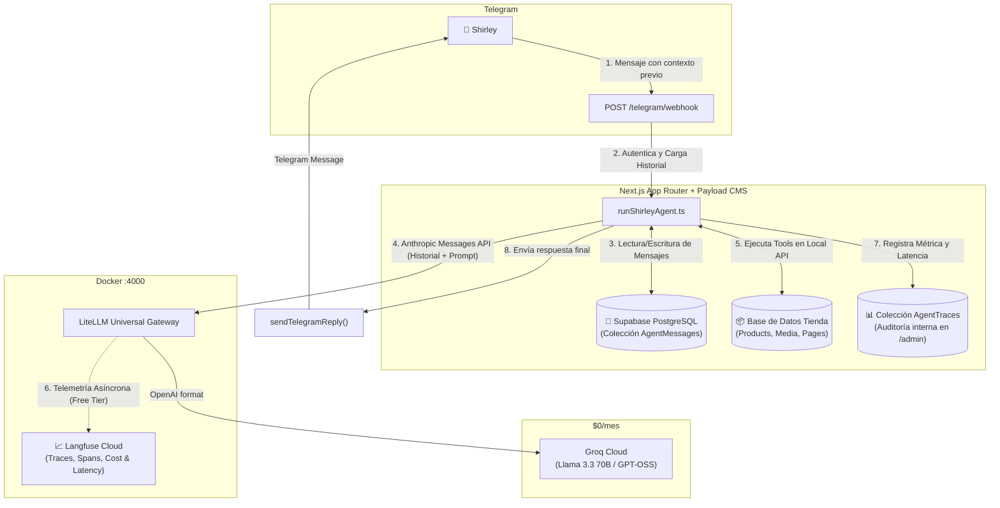

# IP-003: Implementation Proposal — Memoria Conversacional Persistente en Supabase y Observabilidad de IA ($0/mes)

* **Identificador:** `IP-003`
* **Título:** Persistencia de Memoria Conversacional en Supabase y Sistema de Observabilidad de IA para Shirley Bot
* **Autor:** Equipo de Arquitectura & AI Engineering
* **Fecha:** 2026-08-28
* **Estado:** Propuesta Técnica / Lista para Implementación
* **Specs Relacionadas:** [`SPEC-002`](../specs/SPEC-002-management-bot-runtime.md), [`ADR-002`](../adr/ADR-002-claude-agent-sdk-litellm-groq.md), [`CONSTITUTION.md`](../../CONSTITUTION.md)

---

## 1. Resumen Ejecutivo y Objetivos

Actualmente, el asistente de gestión de Shirley ([`runShirleyAgent.ts`](../../src/lib/agent/runShirleyAgent.ts)) opera de forma **stateless** (sin estado): cada mensaje entrante por Telegram se procesa de forma aislada, perdiendo el contexto de las interacciones previas. Además, las métricas de ejecución, latencias de herramientas y consumo de tokens no cuentan con un sistema de telemetría y monitoreo centralizado.

Esta propuesta (`IP-003`) define la arquitectura e implementación para:
1. **Memoria Conversacional Persistente:** Almacenar el historial de diálogo multi-turno en **Supabase (PostgreSQL / Payload CMS)** con ventana deslizante (*sliding context window*), permitiendo conversaciones fluidas y contextuales.
2. **Observabilidad y Trazabilidad de IA ($0/mes):** Instrumentar el runtime agéntico con **Langfuse (Free Cloud Tier)** a nivel de Gateway (LiteLLM) y una colección interna de auditoría en Payload (`AgentTraces`) visible desde `/admin`.

---

## 2. Diagrama de Arquitectura Objetivo



---

## 3. Especificación del Componente 1: Memoria Conversacional Persistente

### 3.1. Colección Payload: `AgentMessages`
Se creará una colección dedicada en Payload CMS conectada a Supabase para registrar cada mensaje y llamada a herramienta:

* **Slug:** `agent-messages`
* **Campos:**
  * `chatId` (`number`, indexado): ID del chat de Telegram del remitente.
  * `role` (`select`: `user` | `assistant` | `system` | `tool`): Rol del mensaje en el protocolo de chat.
  * `content` (`textarea` | `json`): Texto del mensaje o payload devuelto por la herramienta.
  * `toolCalls` (`json`, opcional): Detalle de las tools invocadas si el rol es `assistant`.
  * `toolName` (`text`, opcional): Nombre de la herramienta si el rol es `tool`.
  * `sessionId` (`text`, opcional): Agrupador de sesión basado en fecha/tiempo.
  * `createdAt` / `updatedAt` (`timestamps` automáticos).

### 3.2. Estrategia de Ventana Deslizante (*Sliding Window*)
Para no saturar el límite de contexto (`max_tokens` / límites del tier gratuito de Groq):
* Al recibir un nuevo mensaje, se consultan los **últimos 10 a 15 mensajes** del `chatId` ordenados por `createdAt asc`.
* Se inyectan en el array de `messages` de la petición enviada a LiteLLM.
* Se descartan o comprimen interacciones con más de 48 horas de inactividad para iniciar sesiones limpias.

---

## 4. Especificación del Componente 2: Observabilidad y Trazabilidad de IA

### 4.1. Nivel Gateway: Integración Nativa LiteLLM + Langfuse
LiteLLM cuenta con integración directa sin sobrecarga en la aplicación:

En [`litellm/config.yaml`](../../litellm/config.yaml):
```yaml
litellm_settings:
  drop_params: true
  success_callback: ["langfuse", "custom_callbacks.custom_handler"]
  failure_callback: ["langfuse"]

general_settings:
  master_key: os.environ/LITELLM_MASTER_KEY
```

En variables de entorno (`.env`):
```env
LANGFUSE_PUBLIC_KEY="pk-lf-..."
LANGFUSE_SECRET_KEY="sk-lf-..."
LANGFUSE_HOST="https://cloud.langfuse.com" # Free tier: 50.000 trazas/mes
```

**Métricas monitoreadas automáticamente:**
* Latencia de primer token y latencia total por solicitud ($ms$).
* Trazabilidad de cada paso del bucle agéntico (*Multi-turn agent spans*).
* Conteo exacto de tokens de entrada / salida.
* Detección de errores HTTP 429 (rate limits) y disparos de failover.

### 4.2. Nivel Aplicación: Colección `AgentTraces` en Payload CMS
Para auditoría directa sin salir del panel `/admin`:
* **Campos:** `chatId`, `query`, `responseSummary`, `toolsInvoked` (`array`), `executionTimeMs` (`number`), `status` (`success` | `error`), `errorMessage` (`text`).
* **Visualización:** Tabla administrativa en Payload para consulta inmediata de Shirley o del equipo técnico.

---

## 5. Plan de Ejecución Paso a Paso

1. **Fase 1: Esquema de Datos en Payload (Supabase)**
   * Crear [`src/collections/AgentMessages.ts`](../../src/collections/) y [`src/collections/AgentTraces.ts`](../../src/collections/).
   * Registrar colecciones en [`src/payload.config.ts`](../../src/payload.config.ts).
   * Generar tipos con `pnpm generate:types`.

2. **Fase 2: Adaptar Orquestador Agéntico**
   * Modificar [`runShirleyAgent.ts`](../../src/lib/agent/runShirleyAgent.ts) para:
     * Cargar el historial reciente antes de iniciar el ciclo.
     * Persistir cada mensaje y tool call ejecutada.
     * Medir el tiempo total de ejecución y persistir la traza en `AgentTraces`.

3. **Fase 3: Configurar Telemetría en LiteLLM**
   * Añadir variables de Langfuse en `docker-compose.yml` y `.env.example`.
   * Probar captura de trazas en entorno local y staging.

4. **Fase 4: Pruebas E2E y Validación de Idempotencia**
   * Verificar que la memoria contextual funcione correctamente ante preguntas de seguimiento.
   * Validar que mensajes duplicados no generen entradas dobles en el historial.

---

## 6. Cumplimiento de la Constitución y Restricciones

* **Artículo 1 (Costo $0/mes):** Se utiliza el tier gratuito de Supabase (PostgreSQL) y el tier gratuito de Langfuse Cloud (50k trazas/mes), sin costo recurrente de infraestructura.
* **Artículo 2 (Performance & Latencia):** La consulta de historial añade menos de 15ms sobre PostgreSQL indexado por `chatId`.
* **Artículo 3 (Seguridad & Single-Admin):** Solo los mensajes provenientes de `TELEGRAM_ADMIN_CHAT_ID` acceden y mutan el historial de conversación.
