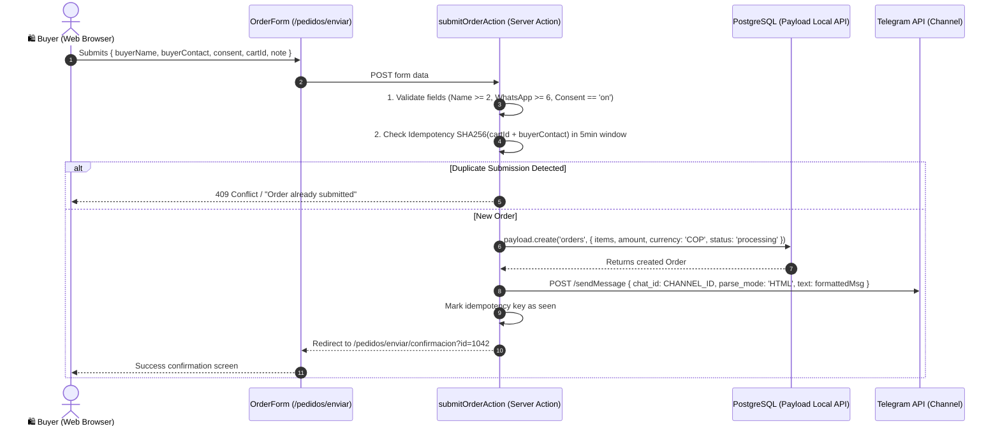

# SPEC-001: Storefront Checkout & Order Notification Subsystem

* **Author:** Engineering Team
* **Status:** Implemented & Verified
* **Related ADR:** [ADR-001](../adr/ADR-001-no-payment-gateway-human-closing.md)
* **Primary Source Files:**
  * `src/app/(app)/pedidos/enviar/OrderForm.tsx`
  * `src/app/(app)/pedidos/enviar/submitOrderAction.ts`
  * `src/lib/idempotency.ts`
  * `src/lib/order-formatter.ts`
  * `src/lib/telegram.ts`

---

## 1. System Overview & Objective

The checkout subsystem enables buyers on `/shop` to submit their cart without an automated payment gateway. It validates legal consent under Colombian law, creates a persistent `Order` record in PostgreSQL with status `processing`, and pushes a structured HTML summary to Shirley's Telegram channel (`@pedidos_nenufar`) so she can immediately initiate human sales closing on WhatsApp.

---

## 2. Sequence Flow



---

## 3. Data Contract & Validation Rules

### Form Fields:
* `buyerName` (`string`, required): Minimum 2 characters.
* `buyerContact` (`string`, required): WhatsApp number, minimum 6 characters.
* `consent` (`string`, required): Must equal `'on'` to verify explicit Colombian Habeas Data (Ley 1581) compliance.
* `cartId` (`string`, required): Valid Payload `Cart` document ID stored in client cookies.
* `note` (`string`, optional): Customization notes or ring/necklace sizing details.

### Payload Order Persistence:
```typescript
await payload.create({
  collection: 'orders',
  data: {
    items: cart.items,
    amount: cart.subtotal,
    currency: 'COP',
    status: 'processing',
    shippingAddress: {
      firstName: buyerName,
      phone: buyerContact,
    },
  },
  overrideAccess: true,
})
```

---

## 4. Idempotency & Fault Tolerance

1. **Double-Submit Prevention:** Uses an in-memory SHA256 hash window of 5 minutes (`cartId + buyerContact`) to prevent duplicate orders when customers click the submit button repeatedly.
2. **Telegram Resilience:** The `Order` is saved in PostgreSQL *before* sending the Telegram notification. If Telegram's API fails (e.g. transient network outage), the order is still safely persisted, an error is logged, and the buyer is redirected with a warning flag (`?warn=1`), ensuring no orders are lost.
