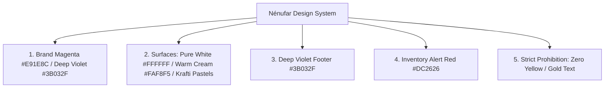

# SPEC-004: Brand Identity & Design System Specification

* **Author:** Engineering & Design Team
* **Status:** Canonical / Active
* **Related Specs:** [SPEC-001](./SPEC-001-storefront-checkout.md), [SPEC-003](./SPEC-003-catalog-landing-blocks.md)
* **Primary Source Files:**
  * `src/app/(app)/globals.css`
  * `tailwind.config.mjs`
  * `src/components/ProductCard/KraftiProductTile.tsx`
  * `src/components/Loading/NenufarLoader.tsx`
  * `src/components/Footer/index.tsx`
  * `src/components/Header/index.client.tsx`

---

## 1. Executive Summary

Nénufar is a luxury artisanal jewelry brand created in Cartagena de Indias by artisan Shirley. The digital experience reflects high-end Caribbean editorial aesthetics inspired by the Krafti template: warm pastel foundations, refined serif typography, high-contrast deep violet footer, and the signature magenta (`#E91E8C`, secondary `#3B032F`) brand anchor.

---

## 2. Canonical Color Palette Tokens

### 2.1. Brand Core Tokens

| Token Name | HEX Code | Tailwind Class / CSS Variable | Purpose & Usage |
| :--- | :--- | :--- | :--- |
| **Brand Magenta (Core)** | `#E91E8C` | `bg-brand`, `text-brand`, `--brand` | Primary CTA buttons, lotus logo icon, active navigation links, highlighted badges. |
| **Brand Dark (Hover)** | `#AD1457` | `bg-brand-dark`, `hover:bg-brand-dark` | Hover & active states for primary buttons and interactive elements. |
| **Brand Secondary (Deep Violet)** | `#3B032F` | `bg-brand-secondary` | Footer background, dark catalog tile, scrolled header. |
| **Brand Light (Pink)** | `#FF4FA3` | `text-brand-accent` | Delicate accent links on dark backgrounds (e.g. *"Escribir a Shirley →"*). |
| **Brand Muted (Tint)** | `#E91E8C1A` (10%) | `bg-brand/10`, `border-brand/20` | Filter pill backgrounds, active pill borders, subtle tag overlays. |

---

### 2.2. Surface & Background Tokens

| Token Name | HEX Code | Context |
| :--- | :--- | :--- |
| **Pure White** | `#FFFFFF` | Global page background, light catalog tiles, crisp dialog modals. |
| **Warm Sand / Ivory** | `#FAF8F5` | Alternating editorial sections (Shirley's Story, Testimonials, Contact). |
| **Pastel Blush Peach** | `#F7EBE1` | Catalog grid alternating tile (Slot 1 in Krafti checkerboard). |
| **Pastel Almond Cream** | `#FAF5ED` | Catalog grid alternating tile (Slot 4 in Krafti checkerboard). |
| **Deep Violet** | `#3B032F` | Footer background + dark catalog tile giving high-contrast luxury closure (secondary brand color). |

---

### 2.3. Functional & State Tokens

| State | HEX Code | Tailwind Class | Usage |
| :--- | :--- | :--- | :--- |
| **Agotado (Out of Stock)** | `#DC2626` / `#EF4444` | `bg-red-600`, `text-white` | Top card badge and disabled hover button when inventory is 0. |
| **Success / Confirmado** | `#16A34A` | `bg-green-600`, `text-white` | Order submitted confirmation badges and toast alerts. |

---

## 3. Strict Anti-Patterns (Canonical Prohibitions)

> [!CAUTION]
> The following visual patterns are strictly forbidden across the entire codebase:

1. **NO Yellow or Gold Text:** Text in `#FACC15`, `amber-200`, `amber-400`, or yellow shades is prohibited. Column headers on dark backgrounds must be pure crisp white (`text-white font-medium`).
2. **NO "COP" Text in UI:** Prices must always be formatted via `Intl.NumberFormat('es-CO')` rendering `$ 45.000` without any literal "COP" suffix.
3. **NO Payment Gateways:** Nénufar operates with zero payment gateway fees. Checkout creates an order and forwards buyer details to Shirley's Telegram.

---

## 4. Typography & Component Anatomy

1. **Titles & Headings:** Serif font in uppercase with wide letter-spacing (`font-serif uppercase tracking-[0.25em]`).
2. **Buttons & Pills:** Full rounded pill shape (`rounded-full px-6 py-2.5 sm:px-7 sm:py-3 text-xs uppercase tracking-wider font-medium`).
3. **Micro-animations:** Smooth `IntersectionObserver` scroll-reveal transitions (`fade-in-up`) on all home page sections.
